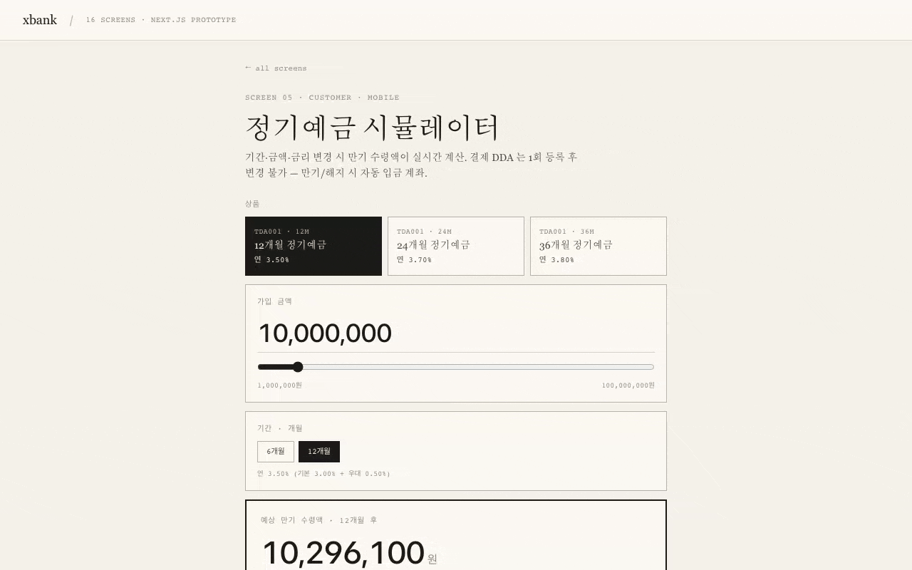
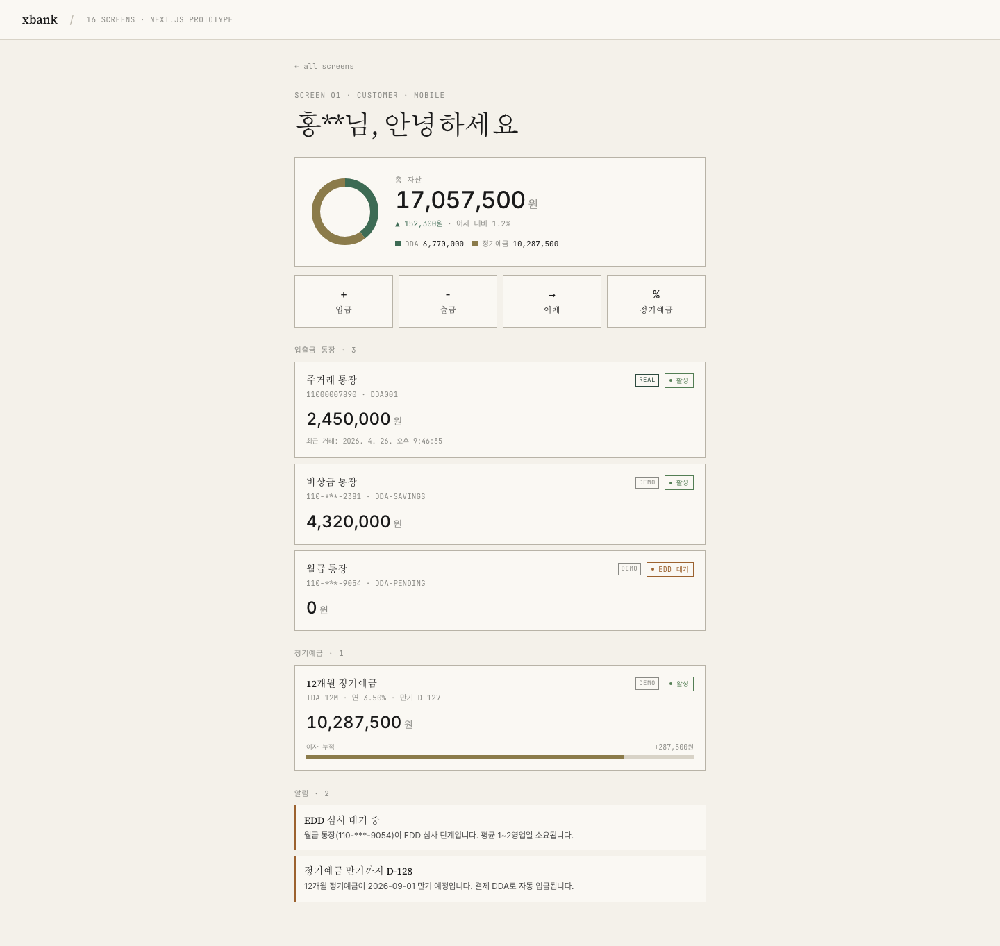
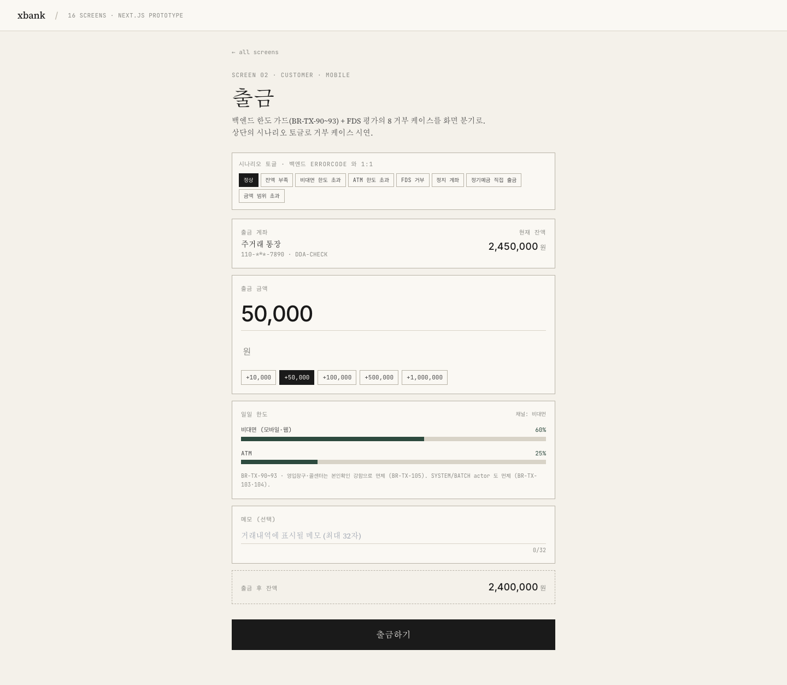
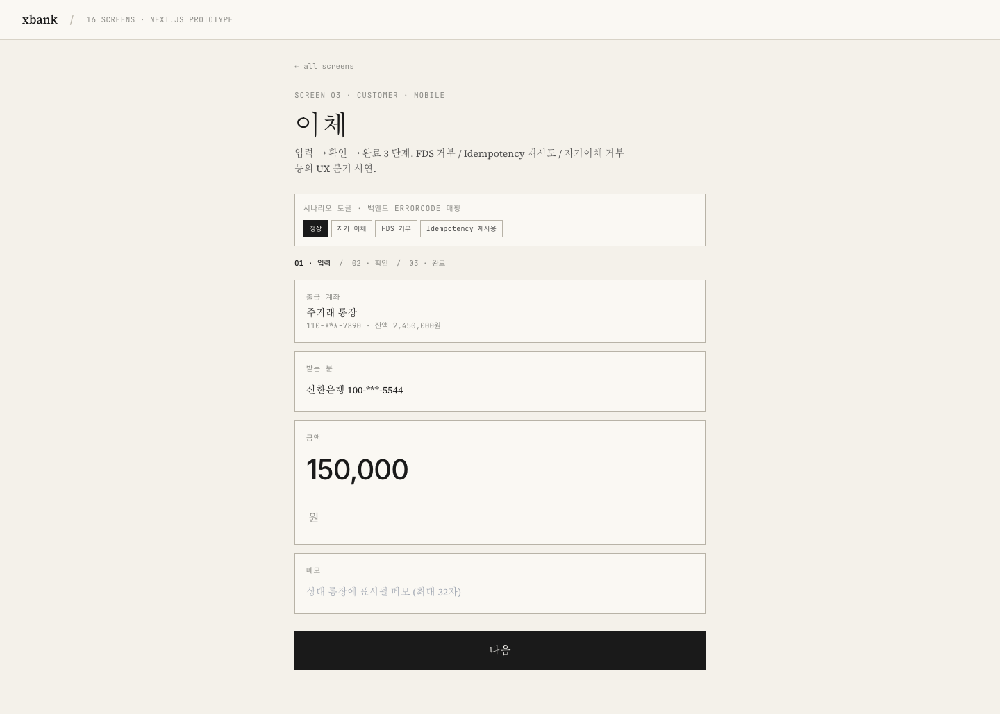
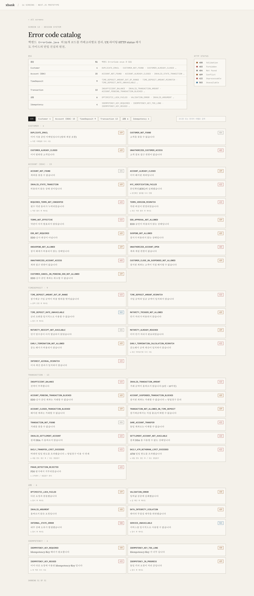
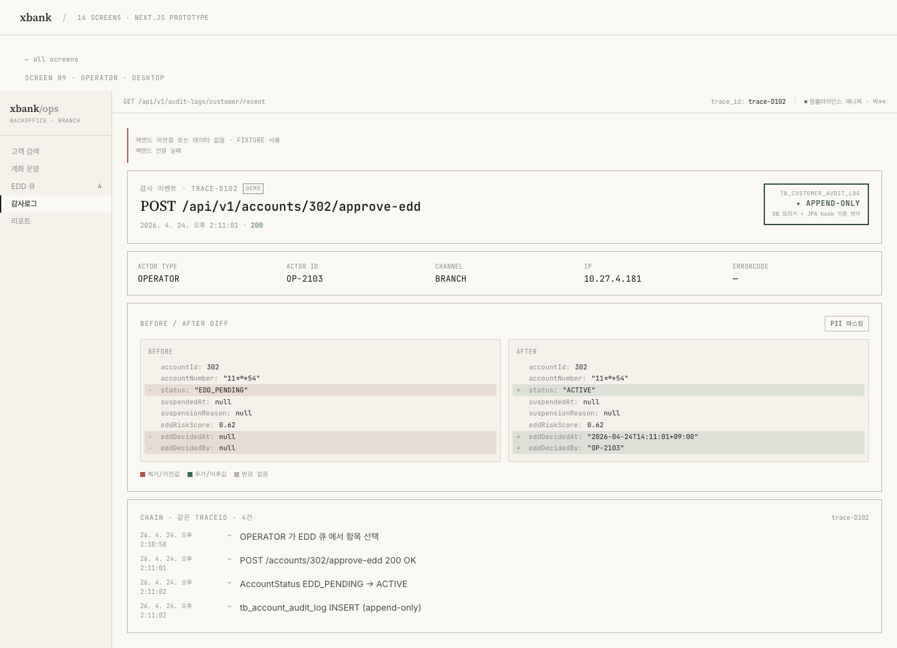
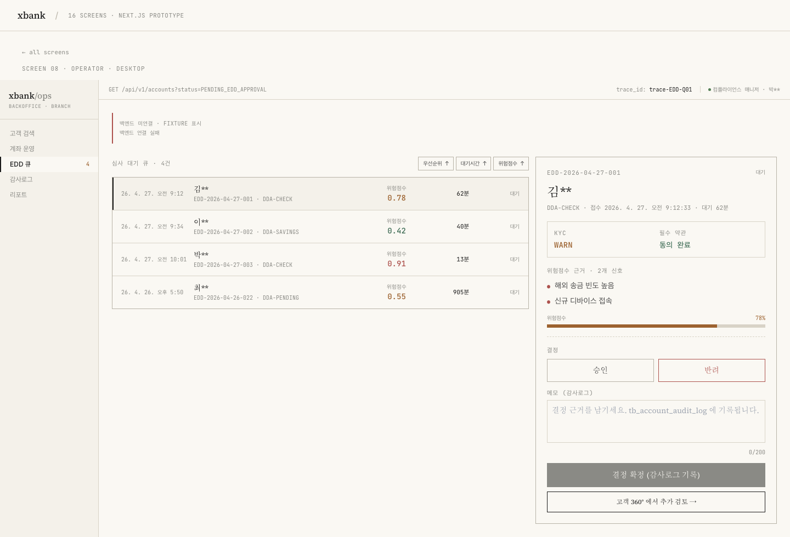
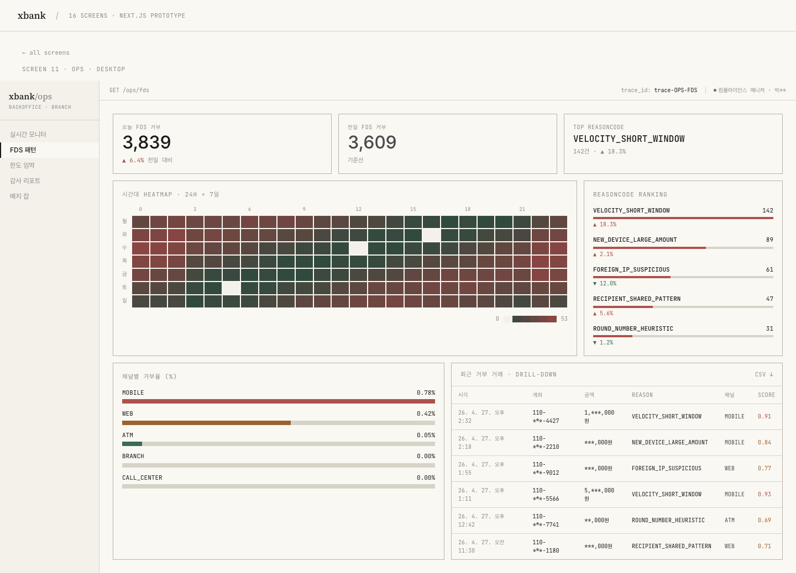
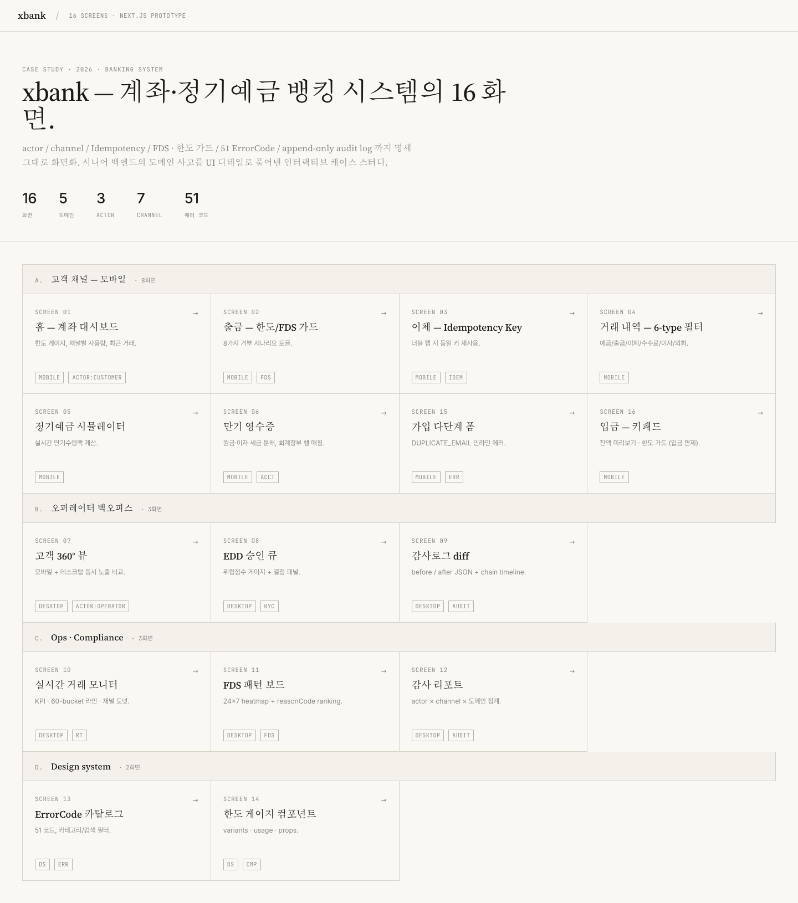

# xbank-next

은행 시스템(백엔드 + 프론트엔드)을 혼자 설계하고 구현한 풀스택 프로젝트의 프론트엔드 코드베이스입니다.
백엔드의 도메인 규칙과 정책이 16개의 화면에 그대로 반영되도록 구성했습니다.

> **함께 개발한 백엔드 프로젝트는 비공개입니다 (NDA).**
> 별도 저장소인 `xbank` 백엔드는 보안 서약에 따라 공개하지 못했습니다.
> 백엔드의 실제 동작은 본 README의 [시연 영상](#시연-영상) 5편으로 확인할 수 있습니다.
> 모든 영상은 Playwright가 실제 백엔드 서버와 통신하며 자동으로 녹화한 결과이며, 화면에 표시되는 거래·감사로그·승인 흐름은 모두 LIVE 응답입니다.

## 목차

- [개발 동기](#개발-동기)
- [주요 기능](#주요-기능)
- [기술 스택](#기술-스택)
- [시연 영상](#시연-영상)
- [화면 갤러리](#화면-갤러리)
- [실행 방법](#실행-방법)
- [프로젝트 구조](#프로젝트-구조)
- [부록](#부록)

## 개발 동기

지난 경력의 대부분을 금융권에서 보내며, 도메인 규칙·정책·에러 코드가 사용자 화면 위에서 어떻게 다뤄지는지를 가까이에서 경험했습니다. 이 프로젝트는 그 경험을 바탕으로, 백엔드와 프론트엔드를 한 사람이 일관된 기준으로 설계하면 어디까지 갈 수 있는지를 직접 검증해보기 위한 케이스 스터디입니다.

특히 다음 두 가지에 비중을 두었습니다.

**시스템의 단일 기준점 (Single Source of Truth)**
백엔드의 enum, 에러 코드, 거래 유형, 채널 정책이 프론트엔드의 토큰·UI 분기·검증 로직과 일치하지 않으면 디자인이 무너지고 운영 사고가 생깁니다. 이 프로젝트에서는 백엔드의 51개 ErrorCode와 모든 enum을 [`src/lib/tokens.ts`](src/lib/tokens.ts), [`src/data/error-codes.ts`](src/data/error-codes.ts) 두 파일에 1:1로 매핑하여, 정책이 바뀌어도 한 곳만 수정하면 16개 화면 전체에 자동으로 반영되도록 만들었습니다.

**예외 흐름까지 포함한 사용자 경험**
정상 흐름이 아니라 한도 초과, FDS 거부, idempotency 충돌, EDD 승인 대기 같은 거부·예외 시나리오를 화면 분기로 풀어내는 데에 비중을 두었습니다. 금융 시스템에서 운영 사고와 컴플라이언스 요구는 보통 이 영역에서 발생합니다.

## 주요 기능

| 영역 | 화면 | 핵심 기능 |
|---|---|---|
| 고객 (Mobile) | 8개 | 자산 대시보드, 입출금, 이체(3단계 + FDS 모달), 거래 내역, 정기예금 가입, 만기 영수증, 가입 폼 |
| 백오피스 (Operator) | 3개 | 고객 360° 뷰, EDD 승인 큐, 감사로그 diff |
| Ops · Compliance | 3개 | 실시간 거래 모니터, FDS 패턴 보드, 감사 리포트 |
| 디자인 시스템 | 2개 | 51개 ErrorCode 카탈로그, 한도 게이지 컴포넌트 가이드 |

16개 화면 중 9개는 정상 시나리오에서 실제 백엔드를 호출하고, 나머지 7개는 fixture 데이터로 동작합니다 (시연 안전성, 자연 발생이 어려운 상태, 백엔드 endpoint 미구현 등이 이유).

## 기술 스택

**Frontend**
- Next.js 14 (App Router) · TypeScript 5.5 strict · Tailwind CSS 3
- openapi-typescript — 백엔드 `/v3/api-docs`로부터 타입 클라이언트 자동 생성
- Playwright 1.59 — 시각 회귀 baseline 32개 + 시연 GIF 자동 녹화

**Backend (별도 저장소, 비공개)**
- Spring Boot 3 · PostgreSQL · Hexagonal Architecture
- 833 tests / 0 failures (회귀 baseline)
- 정책: append-only 감사로그, idempotency 24h, 한도 가드(BR-TX-90~93), FDS Port
- 컴플라이언스: PII 마스킹, 평문 로깅 차단, KMS 교체 가능한 KeyProvider Port

## 시연 영상

5편의 영상은 Playwright가 사용자/운영자 시나리오를 자동으로 수행하며 백엔드와 통신한 결과를 녹화한 것입니다.

### FDS 거부 — ErrorCode 8종을 UI 분기로 매핑
한도 가드(BR-TX-90~93)와 FDS Port의 거부 사유가 그대로 사용자 메시지로 표시됩니다.


### 이체 양변 timeline · Idempotency UX
이체 한 건이 양쪽 거래 내역에 어떻게 기록되는지, 같은 idempotency 키로 재시도하면 어떤 응답이 오는지 보여줍니다.


### append-only 감사 diff
고객 정보 변경 한 건의 before/after JSON, 같은 traceId로 묶인 chain, PII 마스킹 토글이 한 화면에 들어 있습니다. "변조 불가" 배지는 DB 트리거와 JPA hook의 이중 방어를 의미합니다.


### EDD 승인 큐
PENDING_EDD_APPROVAL 상태의 가입 신청을 운영자가 승인하면 계좌가 ACTIVE로 전이되고 감사로그가 자동으로 생성됩니다.


### 정기예금 가입 LIVE
계좌 개설과 결제 DDA 입금이 두 번의 API 호출로 묶여 하나의 가입이 완료됩니다.



## 화면 갤러리

<table>
<tr>
<td><br/><sub>홈 — 자산 대시보드</sub></td>
<td><br/><sub>출금 — 한도 게이지</sub></td>
</tr>
<tr>
<td><br/><sub>이체 — 3단계 + FDS 모달</sub></td>
<td><br/><sub>ErrorCode 카탈로그 — 51개</sub></td>
</tr>
<tr>
<td><br/><sub>감사 diff — chain timeline</sub></td>
<td><br/><sub>EDD 승인 큐</sub></td>
</tr>
<tr>
<td><br/><sub>FDS 패턴 보드</sub></td>
<td><br/><sub>16개 화면 허브</sub></td>
</tr>
</table>

전체 16개 화면은 [`src/app/`](src/app/)의 라우트별 페이지에서 확인할 수 있습니다.

## 실행 방법

```bash
npm install
npm run dev
#   http://localhost:3000  (16개 화면 허브)
```

기본 동작 모드는 fixture입니다. 백엔드 서버가 응답하면 LIVE 영역만 실제 데이터로 교체됩니다. 백엔드 프로젝트는 비공개이므로, 본 저장소만 받아 실행할 경우 모든 화면이 fixture 모드로 동작합니다.

## 프로젝트 구조

```
src/
├── app/              16개 화면 라우팅 (customer · operator · ops · system)
├── api/              fetch wrapper · X-Actor 자동 · Idempotency 자동
├── components/
│   ├── chrome/       PageEyebrow · BackendBanner · Device · DesktopFrame
│   ├── shells/       DeskShell — 백오피스/Ops 사이드바
│   └── primitives/   StatusBadge · SourceBadge · GaugeRow · Money · Donut
├── data/             fixture (백엔드 endpoint 미구현 영역)
└── lib/
    ├── screens.ts    16개 화면 카탈로그
    ├── tokens.ts     백엔드 enum 1:1 매핑
    └── format.ts     ko-KR 포맷 단일 공급원
```

## 부록

### 시각 회귀 검증

```bash
npm run test:e2e          # 32개 baseline 검증
npm run test:e2e:update   # 의도된 변경 후 baseline 갱신
```

### 운영 환경 이식 시 교체할 부분

| 항목 | 현재 | 이식 후 |
|---|---|---|
| 인증 | `DEMO_ACTOR` 하드코딩 (`X-Actor-*` 헤더) | JWT, OIDC, mTLS 등 |
| API base | `localhost:8080` | 환경별 BFF endpoint |
| OpenAPI 노출 | 항상 공개 | prod profile 비공개 |
| fixture | `src/data/*.ts` | 백엔드 endpoint 추가 후 fetch 호출 |
